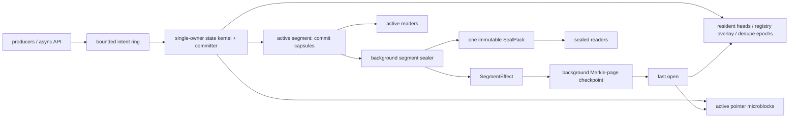

# Design: Asterism, a log-derived state kernel for Mess

**Status:** research design; capability authority amended by
[ADR 0002](../../docs/adr/0002-asterism-capability-authority.md); implementation
requires the spike gates in §19

**Target repository:** `bobisme/mess`, inspected at commit `43e4aca0192f01bb47670627f41182bca182759e`  
**Date:** 2026-07-11  
**Scope:** single-node embedded/server storage; canonical event log, exact metadata, snapshots, replay, subscriptions, and future media placement  
**Non-goal:** a general-purpose ordered key/value engine

**Implementation status (2026-07-14).** The production path remains format
v3. Its registry is now log-derived as explicit `$registry` event batches;
those batches consume canonical global positions and are filtered from
application-facing global reads, so visible positions can have gaps. The v4
control-prelude prototype is proven but held behind its admission gates. This
document describes v4 only as a later alternative; no section below should be
read as saying that v4 is adopted or enabled by default.

---

## 0. Decision in one page

> **Post-audit capability boundary (2026-07-14).** ADR 0002 is normative where
> this older target design groups snapshot installs, projection checkpoints,
> exact dedupe, and registry controls together. Registry remains canonical.
> Snapshot discovery is implemented as immutable self-describing packs with
> discardable discovery metadata. Projection checkpoints and exact batch
> idempotency remain optional decisions in `bn-11mk` and `bn-2ctq`; neither is
> a prerequisite for Fjall deletion. V4 remains a separate decision at
> `bn-1ojm`.

Fjall was the correct choice for Mess when the problem was “we need a fast,
safe, pure-Rust exact metadata store while the custom log stabilizes.” The
accepted spikes and subsequent implementation have already deleted the generic
KV problem from the event-engine hot path.

The original 2026-07-11 architecture performed the following work. This list
is historical motivation, not a description of the current engine:

- it persisted a Fjall metadata batch after each committed append;
- it performed a separate durable Fjall flush before an append that introduced a stream or event-type name;
- it duplicated every payload into an in-memory `Book` and reconstructed that book by decoding the entire history on open;
- it used per-stream append gates, per-append blocking tasks, a global publish sequencer, a global book mutex, the active index, and Fjall in one publish tail;
- it materializes sealed indexes into a per-segment `HashMap`, even though the key set is immutable and the stream ID universe is dense;
- it exposed mutable dedupe rows and an order index in `MetaStore`, although
  production append never populated or queried them.

Today the v3 engine has the accepted flat owner/direct committer, canonical
`$registry`, block-native reads, and an O(streams + event types) `Book`. The
only live Fjall-backed state role is the opt-in snapshot wrapper; direct CLI
`MetaStore` consumers remain operational integration/deletion work. The safest
high-value subset therefore exists independently of v4: single owner on v3,
log-derived registry, bounded payload caches, and header/directory recovery.
Effects/checkpoints and dense state remain independently gated follow-ons.

Asterism replaces this with five coupled mechanisms:

1. **Commit capsules (gated v4 target).** If the format gate is later opened,
   generalize the batch format so an engine-generated control prelude commits
   under the same CRC and marker as user events. Registry codecs are proven;
   dedupe/projection controls require their independent product decisions, and
   ADR 0002 admits no snapshot-install control. One capsule is one atomic state
   transition. The adopted v3 path instead commits an explicit `$registry`
   batch immediately before the domain batch in one ordered durability unit.

2. **A flat-combined state kernel (adopted on v3).** One owner is the direct
   committer/writer and owns validation, position assignment, registry
   allocation, heads, and publication. It does not front a second committer.
   Exact dedupe is not current owner state; it remains an optional feature.

3. **Workload-shaped resident structures.** Dense writer-assigned stream IDs address chunked head/snapshot arrays directly. Active stream pointers live in immutable append-only microblocks. Reader consistency is provided by published group epochs and atomic fields, not by a generic MVCC tree.

4. **Algebraic segment effects and Merkle-page checkpoints.** Every capsule deterministically maps to a compact state effect. Effects compose associatively in log order. At seal, each segment stores only the net effect of its capsules; background checkpoints content-address dirty state pages and anchor them to the committed log prefix. Recovery loads the newest valid checkpoint and folds only later segment effects plus the unsealed tail. It never reconstructs an all-payload book.

5. **Succinct immutable indexes and epoch dedupe.** Sealed stream directories use density-adaptive bitvector/rank or partitioned Elias–Fano layouts, with modern static functions such as PtrHash or cache-line k-perfect hashing admitted only if measurements beat the simple forms. Exact dedupe retains full keys once in the log and indexes compact fingerprints in whole-life epochs, avoiding per-key tombstones and FIFO-order rows.

The proposed steady-state write path is therefore:

```text
producer intent
    -> MPSC ring
    -> single state-kernel owner validates against speculative group state
    -> encode one or more commit capsules
    -> current: k positioned writes; target: one gathered/coalesced write where it fits
    -> durability: none (Process), per batch (Os), or one covering group barrier
    -> apply already-computed effects to resident arrays/microblocks
    -> release-publish one group watermark
    -> complete waiters
```

For an ordinary append, the only durable event-engine bytes are canonical log
bytes. No second database write exists. On the current v3 path, a new-name
append writes the registration batch and first-use domain batch as one ordered
unit. `Process` issues no barrier, `Os` syncs each of those two batches, and
`Group` can cover the gathered group with one barrier. On the gated v4
alternative, both would share one capsule, reducing `Os` to one sync. In either
case the log scanner decides event and registry
visibility. Snapshot discovery remains a separate discardable sidecar by ADR
0002; it is not append authority.

This is not a promise that a prototype will beat Fjall. It is a claim that **specialization creates a plausible path to eliminate entire classes of work**. The design is accepted only if the composed implementation reaches the quantitative gates in §18–§19.

---

## 1. Baseline: what is already excellent

Asterism keeps the strongest parts of the current design unchanged.

### 1.1 Canonical log authority

The normative v3 log establishes that a batch is committed only when its marker and full-batch CRC validate, with global-position contiguity, segment generation, length bounds, no resynchronization past a hole, and no CRC-off fast path. The existing crash matrix, torn-write matrix, and real `SIGKILL` tests are an unusually strong foundation. Asterism preserves A1–A4 and A6–A12. Format v4 replaces A5 with a safety-preserving nonempty-capsule rule, `control_count + event_count >= 1`, and promotes contiguous `batch_id` validation to a recovery-significant rule.

### 1.2 Active/sealed lifecycle

The current active index is in memory and persists at seal. Sealed segments have packed pointer blocks, skip tables, BinaryFuse filters, and columnar payload blocks. That lifecycle is right: mutable state should be tiny and purpose-built; immutable state should be transformed once into its final read shape.

### 1.3 One-stream event batches

A user append is stream-constant, so a batch header carries one stream ID, one category ID, and a consecutive stream-version range. This is an ideal unit for optimistic concurrency, fold chains, active pointer indexing, and segment effects.

### 1.4 Group commit and one durability spine

The current flat owner gathers and validates appends and owns the
`DirectCommitter`. The current physical implementation issues positioned
writes. `Process` has no barrier, `Os` is sync-per-batch by contract, and
`Group` performs one covering barrier for the gathered group. Asterism's
retained target is one gathered/coalesced write where size permits, with
`writev` or bounded chunks for oversized groups. This distinction is
performance-only; capsule framing and the group barrier define correctness.

### 1.5 Sealed columnar payloads

Columnar shredding has already produced byte-exact reassembly, compact storage, and faster-than-target replay. Asterism changes how those bytes are installed and accessed, not the core insight.

---

## 2. The real Fjall gap

### 2.1 Fjall is no longer in the event engine

The current `LogEngine` does not construct `MetaStore` during open, append,
read, seal, or recovery. `stream_heads`, `checkpoints`, `dedupe`,
`dedupe_order`, and their shared high-water rows are dormant public component
surfaces. `FjallSnapshotBackend<LogEngine>` supplies the only live Fjall-backed
state role, discardable snapshot discovery outside the event engine. CLI
metaread/doctor/inspect/retention and `rebuild-index --meta` still open
`MetaStore` directly. Research 13 contains the source-complete keyspace and
caller inventory.

This means the target is not “outperform Fjall at arbitrary KV workloads.” The target is:

```text
append-only source log
+ latest-value-by-dense-id tables
+ bounded exact recent set
+ tiny append-only registries
+ monotone checkpoints
```

That problem has more structure than KV and can use less machinery.

### 2.2 The removed dual-write tail

The pre-flat-owner engine updated the `Book`, active index, and a Fjall
`CommitGroup` after the canonical append. Production now publishes the compact
Book heads/registry and active pointers from the one owner and performs no
post-commit Fjall write. This section records the removed cost; it is not a
remaining implementation task.

Asterism's current v3 path derives heads and registry from accepted log bytes.
Optional future capabilities must earn their own canonical encoding rather
than reviving an implicit metadata database.

### 2.3 The registry position cost

The runtime now derives stream and event-type names from the v3 log. A first
use writes an explicit `$registry` batch immediately before the domain batch as
one ordered unit, eliminating Fjall's authoritative name tables and separate
name barrier without requiring v4.

The accepted v3 cost is position-space visibility: `$registry` records are real
event frames, so they consume canonical global positions. Application-facing
global reads filter stream 0 rather than renumber later domain events; visible
positions are therefore monotone but can have gaps. Cursors must be treated as
opaque ordering/resume tokens, not dense indexes or event counts. The v4
control prelude would avoid that cost, but remains a later gated alternative.

### 2.4 The retired all-history `Book`

Before Spike C, `Book` stored an `Arc` payload plus repeated name/type
references for every committed event, along with per-stream global-position
vectors and heads. That created four costs:

1. startup is proportional to total event count, even when every old segment is sealed;
2. memory is proportional to all retained payload bytes plus object/allocator overhead;
3. append copies payload bytes into both the canonical log encoder and the book;
4. the global `Book` mutex is in the post-commit publish tail and read paths.

Spike C deleted those all-history fields. The current `Book` contains only the
strict registry fold, interned string arcs, heads, and registry allocator
bookkeeping: O(streams + event types), not O(events). Active/sealed payload
reads use raw log/columnar bytes plus bounded caches, and sealing re-reads the
rolled raw segment after the published watermark covers it. “Remove the Book”
below means retire or replace that remaining compact publication structure,
not repeat the completed payload-mirror work.

### 2.5 General structures on dense IDs and immutable sets

Stream IDs are writer-assigned dense integers. A head lookup should not hash an eight-byte integer through an LSM. It should index a chunk and load a compact cell. A sealed segment’s stream set never changes. It should not require rebuilding a Rust `HashMap` with tens of bytes of runtime overhead per stream on every open.

The purpose of the custom engine is to exploit those facts relentlessly.

---

## 3. Design invariants

Asterism adds the following invariants to the existing log invariants.

### K1. One authoritative transition

Every durable change that can affect append validity or canonical event
interpretation is represented in CRC-covered, marker-terminated accepted log
bytes. No mutable metadata database is event authority. ADR 0002 deliberately
keeps snapshot discovery as discardable sidecar state; its loss selects replay
and therefore does not violate this invariant.

### K2. Deterministic fold

Given the same accepted capsule prefix and the same format version, every conforming implementation computes byte-equivalent logical kernel state.

### K3. Publish follows durability

For `Os` and completed `Group` durability, a capsule’s effects become reader-visible only after the capsule is durable. For process-only durability, visibility follows the existing documented cursor-regression semantics.

### K4. No hidden payload authority

Event payload bytes are read from the active log, a sealed payload pack, or a bounded cache of those bytes. An unbounded all-history in-memory copy is forbidden.

### K5. Checkpoints are discardable

Deleting every kernel checkpoint, seal pack, static filter, and resident cache must not change the accepted event/control history. It may only increase recovery or read cost.

### K6. Exactness through verification

A compact fingerprint, approximate filter, perfect hash, learned model, or static retrieval function may identify a candidate. Exact user-visible existence, dedupe, and identity decisions verify the canonical key or record before returning success.

### K7. Bounded foreground work

Ordinary append work is independent of retained-log size. Seal and checkpoint work is outside the append barrier and has explicit backlog limits.

### K8. One-way poison on uncertain persistence

An I/O error from the durability barrier poisons writes. The process may serve explicitly degraded reads, but recovery after restart is the only operation that defines durable truth.

---

## 4. Architecture



The physical directory becomes:

```text
mess/
  segments/
    seg-00000001.log
    seg-00000002.log
    ...
  seals/
    seg-00000001.seal
    seg-00000002.seal
    ...
  kernel/
    pages/<content-hash>.page
    checkpoints/<commit-cursor>.manifest
    current.a
    current.b
  snapshots/
    pack-00000001.snap
    pack-00000002.snap
  parity/                         # optional, offline repair
  LOCK
```

Fjall remains an implementation dependency, but its authority audit is
complete in research 13 and ADR 0002. Snapshot discovery is the only live
Fjall-backed state role and is proven safely discardable; loss falls back to
canonical replay. Direct operational CLI consumers (`metaread`,
doctor/inspect/retention, and `rebuild-index --meta`) still open `MetaStore`.
`bn-3l8n` must migrate applications and offline tooling to the selected
snapshot-pack contract before final API/keyspace/dependency deletion. No
legacy-store migration compatibility feature is planned.

---

## 5. Commit capsules

### 5.1 Why the batch must become the transaction

The v3 batch already proves atomic visibility of a stream-constant event sequence. The missing step is to include the engine state needed to interpret and validate that sequence.

A v4 **commit capsule** is:

```text
CapsuleHeader
[optional fold-chain entry]
ControlRecord*        # frozen engine codec; applied before event decode
EventSubframe*        # zero or more domain events
CommitMarker
```

The capsule’s full bytes are covered by the existing split CRC discipline. The marker makes the entire capsule visible or invisible. A capsule can contain:

- a `StreamRegistered` record and the first events for that new stream;
- an `EventTypeRegistered` record and the first event of that type;
- a dedupe key that covers the event batch;
- a snapshot-head installation after the blob is durable;
- a projection checkpoint;
- a name alias or dictionary registration;
- ordinary events with no control records.

### 5.2 Gated v4 alternative: controls do not consume domain positions

The adopted v3 path does **not** have this property. Its explicit `$registry`
batches consume canonical positions, and application filtering leaves gaps in
the visible domain-event positions. That is the accepted cost of preserving
v3 recovery semantics without making new format bytes a prerequisite for the
log-derived registry.

If v4 is later admitted, registry and checkpoint operations become engine
control rather than event frames. Domain positions can then remain dense over
domain events only. The v4 design introduces an internal capsule sequence—per-
segment `batch_id` becomes recovery-significant—and permits a control-only
capsule with `event_count == 0` when `control_count > 0`.

Recovery validates both:

```text
batch_id == expected_batch_id
first_global_pos == expected_global_pos
```

and advances:

```text
expected_batch_id += 1
expected_global_pos += event_count
```

If adopted, this would restore dense domain positions while giving zero-event
controls a total order and stale-data defense. It is an argument for the later
v4 gate, not a description of current v3 cursor semantics.

### 5.3 Prelude-first decode

Control records use a frozen bootstrap codec. Recovery parses and applies them before decoding any event whose type/codec/dictionary they may introduce. This creates an acyclic rule:

```text
format constants -> control decoder -> registry state -> domain decoder
```

A capsule that introduces ID 42 and then uses ID 42 is self-contained.

### 5.4 Head and transition proofs are implicit

A user capsule’s header carries `stream_id`, `first_stream_version`, and `event_count`. The kernel transition is:

```text
Head(stream) : (first_stream_version - 1) ->
               (first_stream_version + event_count - 1)
```

At append time, the kernel validates the expected prior version. At recovery time, it verifies that the recorded transition continues the reconstructed stream head. A gap or overlap is corruption even if the capsule CRC was somehow recomputed by a malicious actor; with the optional fold chain enabled, the content is additionally tamper-evident.

### 5.5 V3 implementation path

The initial state-kernel work does not require v4. It can derive head/dedupe
effects from v3 batches, while name registration already comes from the
canonical `$registry` stream. The v4 prelude is justified only after the
in-memory kernel proves its foreground advantage.

---

## 6. Single-owner flat-combined state kernel

**Current status:** the v3 flat owner is production. Accepted Spike B evidence
requires the owner to own the writer/barrier (`B0Direct`); placing the old
committer behind it costs 35%. The speculative cross-barrier `B1` pipeline is
rejected: it produced no durable win, lost 5–18% at 64 writers, and would make
the exact barrier cut nondeterministic. This section specifies the adopted B0
shape plus optional future state components.

### 6.1 Ownership model

One dedicated OS thread owns:

- the writer-side head table;
- stream/type/category ID allocation;
- the active registry overlay;
- active dedupe epochs, only if `bn-2ctq` later admits idempotency;
- capsule sequence and global position assignment;
- segment writer and roll decisions;
- speculative state for the current commit group.

Async producers do not call `spawn_blocking` for every append. They push an `Intent` into a bounded MPSC ring and await a one-shot completion. The owner drains up to a byte/count/deadline limit.

```rust
struct Intent {
    stream: StreamNameOrId,
    expected: ExpectedVersion,
    dedupe: Option<Bytes>,
    events: SmallVec<[EncodedEvent; 4]>,
    completion: CompletionSlot,
}
```

### 6.2 Speculative group validation

The owner validates intents in deterministic dequeue order against a group overlay:

```text
group_head[s] = head_after_prior_accepted_intent_in_this_group
```

For each intent:

1. resolve or provision registry IDs in the speculative registry overlay;
2. check the dedupe window;
3. compare `expected` with `group_head[stream]`;
4. on success, reserve consecutive stream/global positions in the overlay;
5. build a capsule descriptor and effect;
6. on conflict/duplicate, complete without writing a capsule.

Two same-stream requests in one group therefore have deterministic semantics. An `Exact(v)` followed by another `Exact(v)` yields one success and one conflict. An internal command-retry path may instead submit the second with the updated version.

The implementation names four frontiers rather than calling all owner state
“durable”:

```text
speculative       validated; discardable on write failure
written/accepted  write returned; Process completion may become eligible
crash-stable      covered by a successful Os/Group barrier
published         reader-visible effects
```

For `Os` and a closed `Group`, `published <= crash-stable`; a successful API
completion implies the capsule is both crash-stable and published. A short
post-barrier interval may still have `published < crash-stable`. Under
`Process`, the exact crash-stable prefix is unknowable until recovery and
`published` may exceed the recovered prefix. Code, metrics, and formal models
must not label the Process watermark “durable.”

### 6.3 One encode/write/barrier

Accepted capsule descriptors are encoded into preallocated group buffers. The
current writer performs positioned writes: none are followed by a barrier in
`Process`, each accepted batch is synced in `Os`, and a gathered `Group` gets
one covering barrier. The
retained target gathers them into one coalesced write where size permits, using
`writev` or bounded chunks for oversized groups. Large payloads need not be
copied merely to achieve syscall-count aesthetics.

The important performance property is not “one thread.” It is **one ownership boundary and one ordering decision**. The existing log has already demonstrated that one committer can approach the device bandwidth ceiling for the target workload.

### 6.4 Apply and publish

The effects were computed before I/O. After successful durability:

1. apply head/registry/dedupe/control effects to writer-owned state;
2. append active pointer entries to microblocks;
3. publish changed reader cells;
4. release-store the group’s published watermark/epoch;
5. complete all successful waiters.

No committed group can acknowledge before its reader state is publishable. Because the same owner assigns positions and publishes effects, acknowledgments cannot arrive out of order and there is no need for a `PublishSequencer`.

### 6.5 Cancellation semantics

Dropping an async caller only drops its receiver. The intent in the owner queue either has not been accepted, or the owner runs it to a terminal result. A committed capsule always publishes. This preserves the current non-cancellable post-assignment guarantee without one blocking task per append.

Dropping a producer while it waits for ring space removes only that waiter: it
has reserved no position, completion slot, queue bytes, or capsule identity.
Dropping after admission releases no owner responsibility; the owner completes
or fails the admitted intent and then releases its byte reservation.

### 6.6 Backpressure

The ring is bounded by bytes, not only intent count. Admission is strict FIFO
among space waiters. This prevents a large request from starving behind a
stream of small requests, at the deliberate cost of head-of-line blocking;
requests larger than the total byte bound are rejected rather than waiting
forever. A cancelled space waiter is unlinked without changing reserved bytes.
Loom/model tests cover both space-waiter and completion-waiter cancellation.
The kernel exports:

```text
queue bytes / intents
oldest queued age
group bytes / capsules / events
validation conflicts
dedupe hits
encode time
write time
barrier time
apply/publish time
```

No hidden unbounded queue is permitted.

---

## 7. Resident state: direct arrays, overlays, and publication

### 7.1 Dense stream-head pages

Writer-assigned stream IDs are dense. Use a two-level chunked array:

```text
page_id = stream_id >> PAGE_BITS
slot    = stream_id & (PAGE_SIZE - 1)
```

A reader-facing cell contains atomics:

```rust
struct HeadCell {
    version: AtomicU64,
    global_position: AtomicU64,
}
```

Pages are allocated only when IDs enter their range. A top-level page directory is published via an RCU/Arc-swap style pointer only on rare growth, not per append.

At 16 bytes per head, one million streams cost roughly 16 MiB before page metadata; ten million cost roughly 160 MiB. This is dramatically less than a generic KV representation and predictable enough to expose in capacity planning.

### 7.2 Coherent reads

Two atomics must be read as one logical head. Each page has an `AtomicU64 sequence`:

```text
writer: sequence += 1 (odd)
        write changed cells
        sequence += 1 with Release (even)
reader: read even sequence with Acquire
        read fields
        re-read sequence
        retry if changed or odd
```

All concurrently accessed fields remain atomic, so the implementation is valid under Rust’s memory model. The sequence counter provides multi-field coherence; it does not make non-atomic races legal. A slow-path page latch may be used after a bounded retry count to avoid starvation under pathological update rates.

A simpler alternative—two copies plus an atomic active-copy selector—is also spike-worthy. The admission criterion is measured reader tail latency and writer cost, not elegance.

### 7.3 Snapshot and checkpoint heads

**Capability amendment:** the structures below remain design alternatives, not
automatically admitted resident components. ADR 0002 keeps snapshot discovery
in a discardable sidecar. Projection checkpoints remain application-owned
unless `bn-11mk` admits a canonical product capability. Do not build dense
snapshot/projection slots without an admitted consumer.

A snapshot-head cell need not store a variable-length pointer. Store an atomic `SnapshotSlot` into an append-only snapshot directory:

```rust
struct SnapshotSlot(u64); // 0 = none
```

The directory entry contains stable compatibility identity, explicit
`Empty`/`Through(v)` coverage, blob-pack location, fold version, trust mode,
and hash-presence flags. State and event-prefix hashes are optional together
for an unverified cache and required together for a certified reference;
current snapshot hashes are otherwise `None`. Entries never mutate; advancing
the head is one atomic slot store.

Projection checkpoints are fewer and named. Keep a small dynamic overlay in memory and checkpoint them as a static registry/table. A future sharded frontier is encoded as an immutable record referenced by a slot.

### 7.4 Registry lookup

The registry has two layers:

```text
base: immutable registry pack from the newest kernel checkpoint
active: small hash table for names introduced since that checkpoint
```

ID-to-name is a dense array of string spans into registry packs. Name-to-ID is either:

- a plain `hashbrown` table for stores where registry memory is small;
- a static function from a keyed 128-bit name fingerprint to a candidate slot, followed by exact string comparison, plus the active hash overlay;
- a density-/size-selected variant proven by the succinct-directory spike.

A static function never decides identity without comparing the canonical bytes.

### 7.5 No generic range contract

The kernel does not pretend these tables support arbitrary ordered ranges. It exposes explicit operations:

```rust
head(stream_id)
snapshot_head(stream_id)
resolve_name(name)
name_for_id(id)
checkpoint(projection_id)
dedupe_lookup(scope, key)
```

This is the decisive simplification over a general KV engine.

---

## 8. Active pointer microblocks

### 8.1 Problem with sharded map-of-vectors

The current active index is already much better than an LSM, but every stream lookup hashes the stream ID, takes a shard lock, and accesses a growable `Vec`. Append can reallocate a hot stream vector; readers contend briefly with the single writer; global entries are duplicated in a separate vector even though the log is already globally ordered.

Spike F accepted stream-side fixed microblocks with linear within-block search
and an every-eight-block skip chain. It rejected binary search within a
32-entry block. Spike J then rejected F's stride-8 global checkpoint array:
the required real `pread` header scan was 10–17x slower than the incumbent.
The accepted global fallback is stride-1, 16 bytes per batch, with no forward
scan. These are target choices; production still uses `ActiveIndex` until the
integration bone lands.

### 8.2 Microblock arena

Use an append-only arena of fixed-capacity stream microblocks:

```rust
const ENTRIES: usize = 32;

struct PtrMicroblock {
    stream_id: u64,
    first_version: u64,
    previous: BlockId,
    published: AtomicU32,
    entries: [MaybeUninit<BatchPtr>; ENTRIES],
}
```

The direct stream table holds the current tail `BlockId`. The single writer:

1. writes an entry into the unpublished slot;
2. release-stores the new `published` count;
3. when full, allocates the next block, links it to the immutable old block, and publishes the new tail ID.

Readers acquire-load the tail and published counts. Old blocks never change. No per-stream `Vec` reallocates, and no shard lock is required.

### 8.3 Search

Each microblock records its covered version range. To resolve a recent version, start at the tail and follow at most the active/unsealed block chain. A segment roll bounds the active history. If workloads create many one-event batches on one stream before a roll, add a small per-stream skip index every 8 microblocks; it is still append-only.

### 8.4 Global active reads

Global replay scans the canonical active segment. Seeking uses a stride-1
resident batch-offset directory maintained by the writer and published with
the group epoch. Do not use stride-8 plus header `pread` scans; that composed
assumption was measured and rejected. A future mmap variant would need its own
fault-tail gate before reconsideration.

### 8.5 Memory reclamation

When a segment’s SealPack is durably installed and no reader holds an active-generation lease, its microblocks are reclaimed in generation-sized slabs. Reclamation is bulk, not per entry. Epoch-based reader leases or `Arc` generation handles make the handoff gapless.

---

## 9. Algebraic segment effects

This is the design’s central mathematical mechanism.

### 9.1 Kernel state as a product

Let kernel state be:

```text
K = H × S × P × R × D
```

**Capability amendment:** the production fold currently admits `H` and `R`
(plus required allocator/frontier bookkeeping). ADR 0002 excludes `S` because
snapshot discovery is a discardable sidecar. `P` and `D` remain conditional on
the product decisions in `bn-11mk` and `bn-2ctq`. The product notation above is
a superset, not required Phase-7 state.

where:

- `H` is stream heads;
- `S` is snapshot heads;
- `P` is projection frontiers/checkpoints;
- `R` is the registry partial bijection and immutable object table;
- `D` is the recent dedupe epoch state.

Every accepted capsule `c` induces a deterministic partial state transition:

```text
apply_c : K -> K
```

“Partial” means a transition can be invalid if stream-version continuity, registry uniqueness, or control-record invariants fail. A committed, valid log is one for which every transition is defined.

### 9.2 Stream transitions form paths

For one stream, a user capsule with `n` events is an arrow:

```text
v -> v + n
```

where `v` is the count of prior events (`first_stream_version`). Two arrows compose only when the first endpoint equals the second start. This is the path composition of a small category, not a commutative update. Recording each segment’s first and last transition per stream permits continuity validation without replaying every intermediate event.

### 9.3 Latest-value effects

For heads, snapshots, and checkpoints, a segment effect stores only the final assignment for each touched key. Define right-biased override:

```text
(A ▷ B)[k] = B[k] if k ∈ dom(B), else A[k]
```

Then:

```text
(A ▷ B) ▷ C = A ▷ (B ▷ C)
```

because for each key the result is the value from the rightmost map containing that key. The operation is associative, has the empty map as identity, and is intentionally not commutative. This means ordered segment effects can be reduced with any parenthesization while preserving log order.

### 9.4 Frontiers

A sharded checkpoint frontier uses pointwise maximum:

```text
(F ⊔ G)[shard] = max(F[shard], G[shard])
```

This component is associative, commutative, and idempotent. It composes safely under retries.

The algebra needs an explicit bottom/existence state. `0` is a valid exclusive
frontier (for example a projection checkpoint at genesis), so absence cannot
be encoded as numeric zero. A component is `Absent` or `Present(position)`;
join uses `Absent` as bottom and pointwise maximum only for present values.

### 9.5 Registry effects

Registry assignments use disjoint union with a conflict state `⊥`:

```text
R1 ⊎ R2 = union, if names and IDs agree on overlap
        = ⊥, otherwise
```

On valid histories, composition never reaches `⊥`. A checkpoint or
SegmentEffect that disagrees with a later canonical registration is rejected
as corrupt. Recovery reuses the existing strict `RegistryState` fold. Effect
idempotence is implemented above it: discard a repeated stable control
identity, then feed each canonical assignment exactly once into
`RegistryState`. Do not weaken `AlreadyRegistered`.

### 9.6 Dedupe effects

Dedupe is parameterized by the current global watermark `w` and exact window span `W`. An entry `(fingerprint, position, key_ptr)` is live iff:

```text
position >= w.saturating_sub(W)
```

`W` must be nonzero. Segment effects store entries grouped by coarse epochs.
Composition concatenates epochs and drops only epochs whose maximum position
is older than the exact boundary. Retained slack never changes correctness
because every candidate position is checked against the exact boundary.

### 9.7 SegmentEffect

At seal, the system emits:

```rust
struct SegmentEffect {
    segment_id: u64,
    epoch: u64,
    first_commit: CommitCursor,
    last_commit: CommitCursor,
    end_global_position: u64,
    head_transitions: SuccinctMap<StreamId, HeadTransition>,
    snapshot_updates: SuccinctMap<StreamId, SnapshotSlot>,
    checkpoint_updates: Vec<CheckpointEffect>,
    registry_delta: RegistryPack,
    dedupe_epochs: Vec<FrozenDedupeEpoch>,
    allocator_boundaries: AllocatorFirstLast,
    effect_hash: Hash256,
}
```

Allocator components carry both first/incoming and last/outgoing values, just
as heads carry path boundaries; a last-only override cannot prove monotonic
continuity across independently built effects. The effect is derived from
already-validated capsules. It is not commit authority. On corruption, rebuild
it by scanning the segment.

The existing v3 extension-region framing and the R2 advisory manifest are
design ancestors, not interchangeable implementations. A specified
`StreamHeadTable` entry contains only `(stream_id, last_version, head_hash)`:
it is partial evidence for the head component and durable fold-certificate
material, not a complete independently composable effect. Production Phase 3
segments currently have empty extension regions, so recovery cannot assume
such a table exists or use it as a scan waiver. Keep rebuildable
`SegmentEffect` bytes in SealPack and durable fold anchors in the extension
region; never publish two authoritative copies of one logical field. A kernel
checkpoint manifest may reuse R2's anchoring and validation discipline while
remaining a separate artifact with its own lifetime and failure domain.

### 9.8 Parallel recovery

Suppose effects `E1 ... En` are in segment order. Associativity permits a
balanced ordered reduction, but accepted Spike D evidence says not to use one
as the production default:

```text
(((E1 ▷ E2) ▷ E3) ▷ ...)
```

or:

```text
reduce_ordered_tree(E1 ... En)
```

provided it never permutes operands. Segment decode/build can run independently
in parallel. The measured implementation scaled effect build 6.8x at eight
threads, while a full tree composition took about 7.0 s at one thread versus
about 0.3 s for direct sequential apply. Production therefore parallelizes
effect build and applies the ordered effects sequentially into dense resident
state (24.3M head transitions/s measured), or chunk-reduces only when a merged
summary is itself required. Algebraic permission is not a performance mandate.

### 9.9 Correctness theorem

Let `scan(L)` be the sequence of accepted capsules in a log prefix `L`. Let `fold` apply their effects from empty genesis state `K0`. A SegmentEffect `E(s)` is correct when:

```text
apply(E(s), K) = fold(capsules(s), K)
```

for every valid incoming `K` compatible with the segment’s first transitions.

By induction on segment count and associativity of effect composition:

```text
fold(scan(S1 ++ ... ++ Sn), K0)
= apply(E(S1) ▷ ... ▷ E(Sn), K0)
```

A kernel checkpoint stores the result of this fold plus the exact log-prefix anchor. Therefore loading a valid checkpoint and folding the suffix is equivalent to full recovery.

---

## 10. Merkle-page kernel checkpoints

### 10.1 Goal

Open time should depend on live state and the uncheckpointed tail, not the total number of historical payloads.

### 10.2 Page format

State is partitioned into fixed logical pages, for example 4,096 head cells per page. A checkpoint writes only dirty pages to a content-addressed page store:

```text
page_hash = BLAKE3(page_kind || logical_page_id || canonical_page_bytes)
path      = kernel/pages/<page_hash>.page
```

Unchanged pages are reused by hash. A checkpoint manifest contains:

```text
format version
commit cursor and global watermark
segment epoch / segment footer root
root of accepted-log prefix or fold anchor
page table: (kind, logical page id, page hash)
registry-pack reference
active dedupe epoch references
manifest CRC + cryptographic hash
```

### 10.3 Installation

1. write missing page blobs to temporary files;
2. verify hashes;
3. make page blobs durable;
4. write and sync a manifest;
5. atomically rename the manifest to its final cursor-derived name;
6. update alternating `current.a` / `current.b` advisory pointers and sync the directory.

Because checkpoints are caches, a crash at any step yields either the old valid checkpoint or no usable new checkpoint. It cannot change committed truth.

### 10.4 Anchor validation

On open, choose the highest manifest for which:

- the manifest checksum/hash validates;
- every referenced page validates;
- the referenced segment epoch and commit cursor exist;
- the log-prefix/fold anchor matches the corresponding sealed footer or checkpoint anchor;
- the manifest watermark does not exceed recovered log end.

Otherwise ignore it and try an older manifest.

### 10.5 Incremental checkpointing

The writer marks state pages dirty in a lock-free bitmap or owner-local bitset. A checkpoint worker takes a published snapshot generation, serializes only dirty pages, and writes a manifest that reuses previous page hashes. The writer never waits for page serialization.

To prevent an unbounded manifest/page chain, periodically emit a logically full manifest and garbage-collect pages unreachable from the newest two or three retained manifests. GC runs only after a durable reachability set is established.

### 10.6 Startup modes

- **Fast:** load the latest manifest, map/read resident head pages, load the compact registry base, install frozen dedupe epochs, then fold SegmentEffects and unsealed capsules after the anchor.
- **No checkpoint:** compose all valid SegmentEffects, scanning only segments missing/corrupt effects, then scan the active tail.
- **Forensic full:** ignore every accelerator and scan every capsule.

All modes must produce the same logical state digest.

---

## 11. SealPack: one immutable artifact per segment

### 11.1 Motivation

The current sealed representation is split across pointer, filter, payload, and optional parity sidecars. Each has its own open, validation, install, and mismatch cases. Asterism consolidates all rebuildable read material except parity into one file.

### 11.2 Layout

```text
SealPackHeader
SectionDirectory
  STREAM_DIRECTORY
  POINTER_BLOCKS
  POINTER_SKIPS
  GLOBAL_OFFSET_INDEX
  STREAM_FILTER
  EVENT_TYPE_FILTER
  PAYLOAD_COLUMNS
  ROW_FALLBACK_BLOCKS
  REGISTRY_DELTA
  SEGMENT_EFFECT
  STATS
section bytes...
SealPackTrailer
```

Each section has kind, version, offset, length, codec, CRC, and optional content hash. Unknown sections are skipped. Critical read accelerators remain advisory: the raw segment is the source for rebuild.

### 11.3 Installation protocol

1. build `<segment>.seal.tmp` from the sealed raw segment;
2. verify every pointer and byte-reassembled payload against the raw segment;
3. write and `fdatasync` the pack;
4. rename to `<segment>.seal` and sync the directory;
5. write the segment’s final footer/trailer containing the SealPack identity hash and sync the segment;
6. publish the sealed generation and retire active microblocks after reader leases drain.

A crash before step 5 leaves a valid but orphaned pack that may be reused after verification or deleted. A crash after step 5 has a footer that names a durable verified pack. Missing/corrupt packs fall back to raw scan.

### 11.4 Read policy

Load tiny directory/filter/effect sections into memory. Read payload blocks explicitly with `pread`/`readv` into a bounded block cache. Avoid mandatory `mmap` for large files so external truncation produces typed I/O/checksum errors rather than a `SIGBUS` process death. An opt-in immutable-file mapping mode may be benchmarked when the deployment controls file mutation.

### 11.5 Parity

Reed–Solomon parity remains a separate optional artifact because repair policy, stripe geometry, and failure domains differ from normal reads. The SealPack stores only a parity reference and parameters.

---

## 12. Succinct sealed directories

### 12.1 Why the current HashMap is not the endpoint

The current sidecar stores a 56-byte directory entry per stream and reconstructs a `HashMap<u64, DirEntry>` on open. A previous hand-rolled FKS perfect-hash spike correctly found that implementation slower and larger than `hashbrown`. That result rejects naive FKS—not all modern static layouts.

Asterism selects among three representations based on segment density and size.

### 12.2 Dense universe: bitvector + rank

For a segment with stream IDs in `[min, max]`, let `U = max-min+1` and `n` be distinct streams. If `U/n` is small, store:

```text
present[U] bitvector
rank directory every 256 or 512 bits
entries[n] in stream-id order
```

Lookup:

```text
i = stream_id - min
if present[i] == 0: absent
slot = rank1(present, i)
entry = entries[slot]
```

This is exact, branch-light, and often one or two cache-line reads. No key copy is needed because the bit position is the key.

### 12.3 Sparse universe: partitioned Elias–Fano

For sparse monotone stream IDs, Elias–Fano stores `n` integers from universe `U` near:

```text
n * ceil(log2(U/n)) + 2n bits
```

plus small select/rank metadata. Partitioning improves locality and adapts to local density. A predecessor/exact lookup finds the entry slot; exact equality verifies membership.

Monotone arrays inside entries—pointer-region ends, skip-region ends, first/last versions—are also candidates for Elias–Fano or Stream VByte delta coding.

### 12.4 Large static sets: cache-line k-perfect hashing

A July 2026 k-perfect hashing result maps each key to a cache-line-sized bin and reports up to 1.5× speedup for very large static tables on two tested architectures. A 2025 PtrHash result reports 2.4 bits/key and 8–12 ns streaming/scalar integer queries in its environment. These are promising but not assumed portable.

For Mess, a k-PHF can map `stream_id` to a small bin containing compact `(key, entry)` records. The full key is stored and compared, so negative and positive queries are exact. This is materially different from the rejected FKS table:

- cache-line binning instead of a sparse second-level slot explosion;
- modern construction and compact pilot metadata;
- exact keys packed with the values;
- an explicit large-`n` admission threshold.

It remains a hypothesis until the repo’s real distributions and CPUs show a win.

### 12.5 Ribbon retrieval

A Ribbon retrieval structure can map a static key to a short value/fingerprint near the information-theoretic bound. Possible uses:

- stream ID -> small directory partition number;
- name fingerprint -> registry candidate slot;
- dedupe fingerprint -> candidate range.

It must be paired with exact key verification. Construction failure or an unfavorable build-time tail falls back to Elias–Fano or sorted arrays.

### 12.6 Representation chooser

At seal, evaluate deterministic cost estimates:

```text
bitmap bytes + rank bytes + entry bytes
PEF bytes + entry bytes
sorted array bytes
k-PHF bytes + packed bins
Ribbon bytes + verification-key bytes
```

The chooser may use benchmark-calibrated CPU coefficients, but the chosen representation and its exact decoder version are stored in the section header. A static representation never affects correctness.

---

## 13. Exact epoch dedupe without mutable KV deletion

> **Optional, not yet admitted.** Spike G proved this component mechanically,
> but `bn-2ctq` owns the exact batch-idempotency product decision. Keep this
> section as research input; do not implement it, add canonical keys, or block
> Fjall deletion unless that bone selects ADMIT.

### 13.1 Define the semantic window

Asterism makes dedupe extent explicit:

```text
WindowByGlobalPosition { span: W }
```

At durable event end `w`, a prior key is a duplicate iff its committed position `p` satisfies:

```text
p >= w.saturating_sub(W)
```

Positions and `w` are zero-based and inclusive, and `W` must be nonzero. When
`w < W`, the window begins at zero. A key exactly at the window start remains
live; a segment covering `[base, end_exclusive)` is reclaimable for dedupe only
when `end_exclusive <= window_start`. Equivalently, an inclusive segment end
must be strictly less than `window_start`. A retry after expiry may append a
duplicate and is documented as such. Time-based policies can be built later
using an event-time index, but global-position windows are deterministic under
recovery.

### 13.2 Store full keys once

The full dedupe key is a control record in the canonical capsule. The resident index stores:

```text
keyed_128_bit_fingerprint -> one or more (position, capsule pointer)
```

The hash is keyed per store to resist adversarial collision attacks. A fingerprint hit always reads/compares the full key from the capsule before declaring a duplicate. Every colliding entry is retained in a small overflow chain or sorted equal-fingerprint run, so hash collisions cannot create false negatives.

This is a new batch/capsule-level API decision, not a migration of current
runtime behavior. One key covers the whole batch. Per-event idempotency requires
one capsule per event or a later vector-valued canonical record. Retry order is
`resolve registration -> exact dedupe -> expected version`: a matching live key
returns the original commit; a missing/expired key follows expected-version
semantics and never silently appends a recovered event twice.

### 13.3 Epochs

Divide positions into coarse epochs, for example `W/8` positions each:

```text
current mutable epoch
7–9 frozen epochs overlapping the exact window
```

The active epoch uses a compact low-associativity or Swiss-style table. When it closes:

1. sort entries by fingerprint;
2. build a static negative filter (BinaryFuse or age-partitioned/blocked Bloom variant);
3. optionally build a k-PHF/Ribbon candidate index if earned;
4. append the frozen epoch to the SegmentEffect/SealPack;
5. drop whole epochs whose maximum position is below the exact boundary.

An epoch retained because it straddles the boundary may contain stale keys; the exact position check rejects them. Thus coarse eviction adds work but never changes semantics.

### 13.4 Query

```text
hash key once
check active table
for frozen epoch newest -> oldest:
    if filter says absent: continue
    locate equal fingerprint candidate range
    for candidates with live position:
        compare canonical full key
        if equal: duplicate
not found: new
```

The common miss path touches a few compact filters and no mutable LSM. There are no per-key tombstones, no FIFO-order keyspace, and no read-before-write to delete stale sequence rows.

### 13.5 Dedupe checkpointing

The current mutable epoch and references to live frozen epochs are included in
the kernel checkpoint. Because full keys remain in canonical capsules until
the dedupe window expires, a lost checkpoint can rebuild exact state from the
relevant log suffix. Retention must preserve those bytes: a segment
`[base, end_exclusive)` is deletable for dedupe only when
`end_exclusive <= window_start`, unless a canonical retention boundary carries
every still-live full key and original result.

---

## 14. Block-native reads after the payload-Book deletion

Spike C implemented this section in production. The remaining compact `Book`
holds registry/heads/interned arcs, not payload history.

### 14.1 Active reads

An active stream pointer resolves to a capsule offset. A reader issues `pread` or a coalesced `readv`, validates the capsule CRC if not already cached, and returns event views backed by an `Arc` block buffer. A bounded decoded-capsule cache absorbs repeated hot reads.

### 14.2 Sealed reads

A SealPack directory resolves stream/version to payload block and event ordinal. The columnar reader decompresses only required columns and returns an immutable block-backed `RecordBatch`.

Sealing no longer consumes `Book.payloads`: it waits for the rolled range to be
covered by the canonical published watermark, re-reads the raw segment, and
builds the pack. The correctness contract is semantic—byte-identical
reassembled payloads and identical pointer/version/position results, with
corruption fallback. Compressed `.pcol` byte identity is only a same-build
regression check.

### 14.3 API evolution

The existing API can continue to return owned `StoredRecord` values through a compatibility adapter, but the engine-native path should be:

```rust
pub struct RecordBatch {
    storage: Arc<BlockBytes>,
    records: Range<usize>,
}

pub struct RecordView<'a> {
    pub stream_id: StreamId,
    pub event_type_id: EventTypeId,
    pub stream_version: u64,
    pub global_position: u64,
    pub metadata: &'a [u8],
    pub data: &'a [u8],
}
```

Typed aggregate replay can decode directly from views, avoiding intermediate `String` and `Vec<u8>` allocations. String names are resolved only for APIs that ask for them.

### 14.4 Global replay

Global replay is a segment scan or SealPack block scan. It does not enumerate a vector of heap objects. Parallel scans concatenate segments by base position and preserve exact order.

### 14.5 Cache policy

Caches are bounded by bytes and separated by object type:

```text
active capsule cache
sealed decompressed payload-block cache
pointer-block cache
registry string-block cache
```

Admission uses measured reuse or TinyLFU-style frequency estimates; correctness never depends on cache residence.

---

## 15. Snapshots without one file per version

> **Install amendment:** ADR 0002 selects immutable self-describing packs plus
> discardable, atomically published copy-on-write discovery roots. The
> canonical `SnapshotInstalled` capsule from the original research proposal is
> not admitted in v3 or v4. The remainder of this section summarizes the
> amended sidecar; ADR 0002 is normative. Missing or corrupt discovery state
> falls back to full replay.

### 15.1 Snapshot packs

One OS-locked writer appends independently commit-framed records to one active
footerless `.open` pack. Offline readers are strictly read-only and use bounded
exact-range reads. Each record carries stable author-supplied
aggregate/schema, fold, and codec identity; coverage ordered as
`Empty < Through(0) < Through(1) ...`; trust mode; and exact
`(store UUID, PackId, offset, length, record hash)` binding.

```text
active: SnapshotPackHeader + CommittedRecord*
sealed: SnapshotPackHeader + CommittedRecord* + PackIndex + Footer
```

Roll appends and syncs the index/footer, renames to `.pack`, syncs the
directory, and never appends to that sealed pack again. UUID-scoped IDs are
never reused, so stale descriptors cannot observe ABA.

### 15.2 Install protocol

1. append and validate complete record frames under the shared writer owner;
2. copy-on-write only changed discovery-tree leaves and paths;
3. in `Durable` mode, compare the whole reachable root closure with a prior
   acknowledged durable root/checksummed durable-proof ledger and promote every
   unproven pack frontier, page/file, and creation/rename directory entry;
4. durably publish the proof ledger, then sync and rename a small independently
   resolvable UUID/generation root that marks complete-closure durability and
   binds the proof generation/closure hash, then sync its directory;
5. publish in-process and acknowledge only after the complete closure survives.

`Buffered` is the default discardable-cache mode and makes no power-loss
promise. `Durable` promises the ordered barriers above for every head reachable
from the root, not just the newly saved head. A Buffered page/record inherited
by a later Durable root is promoted even when it belongs to another key. An
existing content-addressed page whose write was skipped still needs file and
directory promotion unless a prior durable proof covers it; a newly created
active `.open` pack needs its creation directory synced. Clone saves may group
under bounded count/bytes/deadline policy; any durable member makes the whole
group durable. Promotion bytes/files/frontiers and data, directory, ledger, and
root barriers are measured. No save rewrites a flat all-head manifest.

### 15.3 Recovery and corruption

If a root/page/frame, compatibility identity, codec, or semantic certificate
fails, try an explicitly retained older root/candidate or replay from the log.
At equal coverage, validate the current record first: an invalid record may be
repaired, an identical valid record is idempotent, and a different valid record
is a conflict. Unverified cache mode omits both semantic hashes; certified mode
requires both, but even a record hash plus semantic hashes is not proof that a
malicious writer executed the fold. The event log remains authoritative.

Ordinary open and point lookup never enumerate all heads. Doctor, inspect, and
retention use a pinned-root `scan_snapshots(cursor, limit)` seam: the pin holds
a shared deletion lease on one UUID/generation, the opaque cursor is bound to
that root and last tree position, and capped pages use memory bounded by tree
height plus `limit`. Diagnostics may explicitly report a validated partial
scan. Destructive retention requires a complete corruption-free traversal and
same-root revalidation; cursor mismatch, lost pin, or a corrupt/missing page
fails closed. The one-million-head full scan has explicit wall-time and peak-
RSS gates in addition to ordinary point-lookup gates.

### 15.4 Retention

Retain at least two complete root generations. Under the writer lock, GC first
promotes the complete reachable closure and acknowledges a new Durable root;
graph readability alone is not sufficient. It then validates every additional
retained root graph, prunes old roots and unconditionally syncs that directory,
and only then deletes sealed packs/pages unreachable from remaining roots plus
the active pack. It unconditionally syncs all deletion directories before
completion.
This destructive ordering applies even when ordinary snapshot saves are
`Buffered`; buffered GC may defer deletion but cannot prune non-durably and
then reclaim. A promotion/root failure prevents pruning and a prune barrier
failure prevents dependent deletion. Crashes can leave extra roots or orphans;
the GC Durable root remains fully resolvable. Snapshot roots never authorize
event-log deletion.

---

## 16. Recovery

### 16.1 Fast path

```text
1. acquire the store lock
2. recover segment headers/footers and canonical log end using existing rules
3. select newest kernel checkpoint whose anchor matches the log
4. load resident head/snapshot pages and registry base
5. install frozen dedupe epochs referenced by the checkpoint
6. compose later valid SegmentEffects in order
7. scan only segments lacking effects and the unsealed tail
8. rebuild active microblocks for every unsealed segment
9. resume the active writer at the recovered safe offset
```

No old payload is decoded merely to open the store.

### 16.2 Effect integrity

Each SegmentEffect includes:

- segment ID/epoch/base/end cross-checks;
- capsule cursor range;
- canonical encoding version;
- CRC and hash;
- continuity summaries for first/last stream transitions.

A mismatch discards the effect and scans the corresponding raw segment. The repair is local.

### 16.3 Parallelism

Sealed segments with missing effects can be scanned independently. Build those
effects in parallel, then apply them sequentially in segment order to resident
state. Do not default to materializing a full ordered tree-reduced effect: Spike
D measured that path substantially slower than direct apply. Payload
decompression is unnecessary for head/registry/dedupe recovery except where a
control record’s exact key bytes must be extracted; control preludes are
independently length-framed.

### 16.4 Recovery digest

Every recovery mode computes a canonical kernel-state digest over:

```text
heads
snapshot slots
registry IDs/names/object hashes
projection frontiers
dedupe live-set fingerprints + exact key hashes
```

Differential tests compare fast checkpoint recovery, effect-only recovery, and full capsule scan. Equal digests are a release gate.

---

## 17. Durability and media placement

### 17.1 Stronger by subtraction

Asterism improves event-engine durability primarily by removing cross-file
transactional states. The pre-flat-owner comparison was:

```text
historical ordinary append:
  log capsule durable
  then derived Fjall batch may lag and is repaired

current v3 ordinary append:
  log capsule durable == event + metadata effect durable
```

For new names, current v3 writes `$registry` plus first use in one ordered unit:
zero barriers under `Process`, one sync per batch under `Os`, or one covering
barrier under `Group`. V4 could put both in one capsule (and reduce `Os` to one
sync) but is not required.
Snapshot discovery follows ADR 0002's separate discardable pack/root protocol;
kernel checkpoints and SealPacks remain non-authoritative.

### 17.2 Existing modes remain

```rust
enum Durability {
    Process,
    Os,
    Group { max_delay: Duration, max_bytes: u64 },
}
```

Group commit retains early close when all in-flight producers are pending, byte
close near the device knee, and a maximum delay cap. The group owner advances
the position-ordered crash-stable watermark only after the covering barrier.

### 17.3 EIO

Any `fsync`/`fdatasync`/durable-write error poisons the writer. No retry-and-continue path exists. Reads may continue only with an explicit degraded state and warning that page-cache-visible bytes may not survive restart.

### 17.4 Out-of-place everything

Recent PVLDB work reports large throughput and flash-write improvements from redesigning a B-tree engine around out-of-place writes and lifetime-aware placement. Asterism is naturally out-of-place:

- event segments append and then freeze;
- SealPacks are write-once;
- snapshot packs append and freeze;
- kernel pages are content-addressed and immutable;
- checkpoints are new manifests;
- dedupe epochs expire as whole units.

No hot metadata page is rewritten on each event.

### 17.5 Lifetime classes

Keep files with similar death times together:

```text
very long: canonical event segments under infinite retention
long: SealPacks and registry/checkpoint base pages
medium: snapshot packs
short: active dedupe epochs and temporary seal/checkpoint files
```

On ordinary SSDs this reduces mixed-lifetime garbage collection pressure. On FDP-capable devices, classes map to placement handles. On ZNS, a segment/pack maps naturally to a zone and whole-object deletion maps to zone reset. These remain optional backends; the correctness model stays file-based.

### 17.6 Direct I/O and io_uring

Neither is a default. The design first removes software work and redundant writes. A later backend may use registered buffers, fixed files, batched `readv`/`writev`, or direct I/O when device-specific measurements show a win. No API or format semantic depends on it.

---

## 18. Performance model and targets

All figures below are **targets or derived budgets**, not measured Asterism results.

### 18.1 Foreground append budget

The original single 85%-of-bare gate is historical. The locked matched matrix
showed that composed/bare ratio varies primarily by batch size: the
pre-flat-owner engine was 17–39% of bare for 4-writer batches 1–100 and 86–95%
at batch 1000. The accepted flat owner lifted the small/medium cells
substantially and beat that predecessor in every measured cell, but still
failed 85% below batch 1000 because the remaining cost is producer/API wake
topology. A single headline ratio, including the earlier matched 4x10 ~84%
orientation row, must not stand in for the matrix.

The historical Spike B admission gate, already passed, was:

```text
Process >= 1.20x matched pre-flat-owner engine
Group >= 95% matched pre-flat-owner engine at >=4 writers
p99 <= matched pre-flat-owner engine
barrier count == matched bare log
```

The flat owner is now production, so that threshold is not a perpetual demand
for another 20% over itself. Phase 4 and later use
[`BN-2SU-FINAL.csv`](../../spikes/baseline_matrix/BN-2SU-FINAL.csv) as the
prelocked per-cell baseline: Process and Group throughput, p99, and barrier
budgets are compared cell by cell; no Process cell regresses without explicit
product approval; Group non-regression and barrier parity hold; and any allowed
tolerance is declared before measurement. Every result retains its raw matrix.

Every cell controls payload size, batch size, concurrency, stream distribution,
filesystem, device/cache state, and producer topology. Reports commit accepted
and rejected raw rows, machine/load metadata, and barrier counts. The old 85%
line remains an aspirational API gate for a separately measured owned-record,
interned-type, producer-combining design; it is not a reason to discard the
already-adopted owner.

### 18.2 Absolute reference gates

On the existing Ryzen 3900X reference host or a calibrated successor:

```text
head lookup, resident:        p50 <= 50 ns, p99 <= 150 ns
snapshot-head lookup:         p50 <= 50 ns, p99 <= 150 ns
active dedupe miss:           p50 <= 100 ns
frozen dedupe negative:       <= 80 ns per whole window target
ordinary metadata apply:      >= 20M capsule effects/s, one owner, no I/O
foreground allocations:       zero after warm-up for <=4-event append
ordinary metadata syscalls:   zero beyond canonical log write/barrier
new-name barriers:            Process 0; Os 2 for v3 registry+domain; Group 1 covering
```

These values are aggressive and intended to kill weak designs early.

### 18.3 Startup gates

```text
open after clean checkpoint:
  no event payload decode
  work proportional to resident state pages + suffix, not retained events

100M retained events, <=1M live streams, <=256 MiB active tail:
  target <= 1.0 s on the reference NVMe after warm filesystem metadata
  cold result reported separately; no hidden page-cache precondition
```

A more portable ratio gate is:

```text
checkpoint open <= 10% of full scanner+Book-rebuild time
```

Run the 100M-event open case early with the existing recovery-scale harness,
even if the corpus is synthetic. Until that run exists, keep extrapolations
derived and publish the measured 1M/10M results separately; do not promote the
100M target or arithmetic reachability to a measured claim.

### 18.4 Memory and disk

```text
resident head table:          <= 20 B/live stream including page overhead
resident snapshot slots:      <= 10 B/stream with a snapshot
sealed directory runtime:     target <= 16 B/touched stream; stretch <= 8 B
active pointer metadata:      <= 24 B/committed batch before seal
metadata host write amp:      <= 0.5 B/event averaged over checkpoint cycles,
                              excluding control bytes stored once in log
```

The metadata write-amplification target counts checkpoint/SealPack bytes and divides by events. It must be reported separately from event payload and columnar pack bytes.

### 18.5 Durability

```text
Group throughput/p99: meet the prelocked BN-2SU-FINAL per-cell budget
Os throughput/p99: meet a separately prelocked matched per-cell budget
all tolerances: declared before measurement
barrier count: matched bare-log parity
acked losses: 0
partial/control-only capsules visible: 0
registry/event split-brain outcomes: 0
checkpoint-caused wrong state: 0
```

Durable throughput is often device-barrier-bound, so the expected win is lower
CPU and Group coalescing—not magical elimination of flash latency. V3 `Os`
deliberately remains sync-per-batch; only a same-capsule v4 registration could
make registry+first-use one `Os` sync.

---

## 19. Spike ledger and admission results

The authoritative detail and committed raw artifacts live under `spikes/`;
research 05 preserves the original methods and gates. Lettering is A–J
everywhere:

| spike | result carried into the design |
|---|---|
| A — dense heads | **ADOPT mechanism:** packed lock-free `AtomicU128` when available, page seqlock fallback; not yet integrated. |
| B — flat owner | **ADOPT and integrated:** owner must be the direct writer/committer. Reject a second committer and reject B1 barrier pipelining. |
| C — no payload Book | **ADOPT and integrated:** block-native reads, bounded caches, raw-segment seal source, watermark readiness. |
| D — SegmentEffect/checkpoint | **PROCEED:** all equivalence/open/apply gates passed. Parallel build, sequential ordered apply; explicit frontier bottom and allocator first/last boundaries. Not yet integrated. |
| E — v4 control prelude | **FORMAT ADMISSIBLE, product OFF:** crash/fuzz/scan gates passed; mandatory allocation-free validate/materialize split. ADR/product gates still control use. |
| F — active microblocks | **ADOPT stream side:** linear 32-entry blocks + skip every eight blocks. Reject binary search; reject stride-8 globals after J and use stride-1. Not yet integrated. |
| G — exact epoch dedupe | **ADOPT candidate mechanism, optional product:** G2 hashbrown active + sorted frozen epochs + BinaryFuse16; Fjall baseline was synthetic. |
| H — static directory | **ADOPT density arm:** bitvector+rank for dense/real regions with deterministic sorted/HashMap fallback; reject PEF/PtrHash/k-bin candidates tested. |
| I — SealPack | **ADMIT behind default-off option:** semantic replay and install/open gates passed; default-on still requires its named RSS/footer-binding follow-ups. |
| J — composed decision | **NARROW/ADOPT proven parts:** flat owner highest priority, Book win retained, per-cell gates replace one ratio; no integrated “all Asterism” engine was claimed. |

V4 remains a separate admission decision, not a migration phase and not an
automatic consequence of its format proof. Snapshot discovery follows ADR
0002 and emits no v4 install control.

---

## 20. Migration

### 20.1 Status: no migration program

As confirmed on 2026-07-13, Mess has no users and no existing stores. There is
therefore no installed v3/Fjall corpus to preserve, shadow, import, roll back, or
upgrade in place. The M0–M9 program in
[Research 06](research/06-migration-plan.md) is superseded and retained only as
historical architecture and data-loss-trap analysis. Its `mess migrate`
commands, compatibility releases, mixed-version cutover, and rollback tooling
will not be implemented.

Development uses fresh stores. Fjall retirement is consequently an authority
audit plus direct implementation change, not a legacy-store migration:

1. stream and event-type names are already canonical `$registry` records in the
   log, so Fjall no longer holds the non-rebuildable name authority that
   originally required an import;
2. every remaining Fjall keyspace must be audited for hidden authority, then
   made log-derived or proven safely discardable before it is deleted;
3. no temporary Fjall compatibility view or shadow-write release is required;
4. v4, if adopted, is a format decision for fresh stores rather than an upgrade
   path for a legacy fleet.

Book retirement and the single-owner append path were implementation steps, not
migration phases. Their correctness remains covered by recovery, differential,
crash, and cancellation tests rather than a legacy-store shadow deployment.

### 20.2 Lessons retained from the historical plan

Removing the rollout does not erase the hazards it exposed. Any future change
that deletes or replaces persistent state must still:

- inventory which values are canonical versus rebuildable before deletion;
- prove every numeric ID resolves from earlier canonical log state;
- preserve full dedupe keys if state ever crosses an authority boundary;
- order durable snapshot blobs before the heads that promise them;
- bind checkpoints to the exact canonical log prefix and fall back on mismatch;
- refuse unknown on-disk versions instead of skipping, truncating, or silently
  downgrading them.

If persisted stores exist before some future incompatible transition, that is a
new product decision. Research 06 is input to a newly scoped plan, not a dormant
roadmap to activate unchanged.

---

## 21. Risks and hard kill criteria

### 21.1 Complexity moves into Mess

Removing Fjall means Mess owns metadata concurrency, checkpoint formats, dedupe
indexing, and rebuild verification. With no existing stores, it does not also
require a compatibility migration layer. The replacement is justified only by
end-to-end wins and stronger single-authority semantics. A pile of clever
microstructures that does not improve the composed path should be deleted.

### 21.2 Dense IDs are a contract

Direct tables rely on writer-assigned dense IDs. Importers must remap sparse external IDs or use a sparse page directory. An attacker must not allocate arbitrarily huge IDs through the public API.

### 21.3 Seqlock reader starvation

A hot page may cause retries. Measure p99/p99.9 under worst-case one-stream and adjacent-stream updates. Add a bounded-retry latch path. If a simple atomic-copy design is faster and safer, use it.

### 21.4 Static-function glamour

PtrHash, k-PHF, and Ribbon are optional. The previous FKS result is a warning: theoretical compactness does not guarantee a Rust implementation beats `hashbrown`. Admission requires real segment data, construction tails, negative lookups, RSS, and reopen costs.

### 21.5 Dedupe collision exactness

No “128 bits is practically exact” shortcut. The implementation stores all equal-fingerprint candidates and compares full keys. Property tests force synthetic collisions.

### 21.6 Checkpoint corruption and chain growth

Every checkpoint is anchored and discardable. Missing pages, stale manifests, or hash mismatches fall back. Checkpoint retention and page GC are tested under interruption at every operation.

### 21.7 Format surface

The current decision is to keep the registry as explicit v3 `$registry` event
batches and accept the canonical positions they consume. Application-facing
reads filter those records, so visible positions have gaps and remain opaque
monotone cursors. v4 adds control records and zero-event capsules that could
restore dense domain positions, but its formal/crash proof is an admission
prerequisite, not sufficient by itself to turn the format on. Until a separate
gate explicitly adopts it, v4 remains off and v3 semantics govern.

### 21.8 Kill criteria

Stop or narrow a remaining mechanism if any is true in its matched composed
matrix. The historical 85%-of-bare line is no longer a universal kill switch:

```text
the current phase misses a prelocked BN-2SU-FINAL per-cell throughput, p99, or
  barrier budget; uses an undeclared tolerance; or omits the raw matrix
clean checkpoint open still scans old payloads
resident metadata > 2x its packed information content without a measured reason
v4 crash model admits any split control/event state
admitted dedupe fails exactness, composed public-path gates, or bounded work
maintenance burden causes the crash/formal suites to be bypassed
```

---

## 22. What is genuinely novel here

Most ingredients have prior art. The potentially publishable contribution is their composition around event-log semantics:

1. **Control-prelude commit capsules** that atomically introduce interpretation metadata and domain events without consuming domain positions.
2. **SegmentEffect algebra** that summarizes a mixed event/control log as composable stream-transition paths plus right-biased state maps, enabling parallel recovery and content-addressed incremental checkpoints.
3. **Exact epoch dedupe over canonical keys**: full keys stored once in log capsules, compact fingerprint epochs for candidates, approximate structures only for negative acceleration, and exact boundary checks permitting whole-epoch reclamation.
4. **A density-adaptive immutable stream directory** selected at seal among rank/select, Elias–Fano, and cache-line static functions, with correctness unified by exact key verification.
5. **One durability spine from API intent through state publication**: flat-combined validation and group commit, with no post-commit mutable metadata database.

The claim is not that each data structure is new. The claim is that an event store can turn its log from “payload plus a separate index database” into a **proof-carrying state-transition medium**, while preserving a simple append API and aggressively optimizing every derived representation by lifecycle.

---

## 23. Current implementation order

```text
done: log-derived v3 registry
done: direct flat owner/writer
done: all-history payload-Book removal and block-native reads
next: ADR-0002 snapshot packs/discovery + full app/CLI adoption
then: remove dormant MetaStore/Fjall production surfaces
independent integration: dense heads, stream microblocks + stride-1 globals,
  SegmentEffects/checkpoints, bitrank directory, SealPack follow-ups
conditional: exact batch idempotency (bn-2ctq), projection controls (bn-11mk)
separate format decision: v4 (bn-1ojm)
optional: FDP/ZNS placement backend
```

Snapshot replacement plus end-to-end adoption is the only live Fjall-deletion
critical path. Dedupe, projection controls, SegmentEffects, and v4 do not block
that deletion. Already accepted component mechanisms still require production
integration evidence; a spike result is not a claim that current code uses it.

---

## 24. Bottom line

Fjall gave Mess a robust, fast metadata substrate while the custom log, crash semantics, sealing, compression, and replay paths matured. It should now be treated as the control group.

Asterism’s wager is sharper:

> An immutable event store should not maintain canonical current state by
> writing a second mutable database. It should encode authoritative transitions
> in accepted log bytes—one ordered v3 unit today or one gated v4 capsule—publish
> the hot result into direct resident structures, and, where admitted,
> periodically collapse history into algebraic effects and self-verifying pages.

The implemented subset already realizes the Fjall-free event path and payload-
Book removal; the remaining bullets mix current gains with separately admitted
targets:

- one durability authority instead of a log plus lagging metadata state;
- no Fjall name flush; v3 first use uses Process 0 barriers, Os one sync per
  registry/domain batch, or one covering Group barrier;
- no per-append generic KV write, compaction, or tombstone path;
- no all-history payload mirror or payload-proportional startup;
- deterministic, parallelizable recovery from composable effects;
- immutable indexes selected for the actual density and lifecycle of each segment;
- a natural path to lifetime-aware SSD placement and zoned media;
- a smaller, more explainable failure state space.

That is the design worth trying to make Fjall unnecessary—not by cloning it, but by making its job disappear.

---

## Primary references

### Mess implementation and measurements

- [Accepted capability authority](../../docs/adr/0002-asterism-capability-authority.md)
- [Current source/authority audit](research/13-authority-and-fjall-deletion-map.md)
- [Current composed engine and compact `Book`](../../crates/mess-store/src/engine.rs)
- [Current direct committer](../../crates/mess-log/src/committer.rs)
- [Current snapshot wrapper](../../crates/mess-store/src/fjall_snapshot.rs)
- [Current/dormant Fjall metadata component](../../crates/mess-index/src/meta/mod.rs)
- [Flat-owner evidence](../../spikes/flat_combined_append/REPORT.md)
- [Composed decision and raw-artifact index](../../spikes/composed_decision/REPORT.md)
- [Historical performance and correctness envelope](../../docs/perf/envelope.md)
- [Normative v3 log format](../../docs/spec/01-log-format.md)
- [Normative registry design](../../docs/spec/04-registry.md)

### External primary work

- [Fjall](https://github.com/fjall-rs/fjall)
- [PtrHash: Minimal Perfect Hashing at RAM Throughput](https://arxiv.org/abs/2502.15539)
- [Non-minimal k-perfect hashing and fast static hash tables](https://arxiv.org/abs/2607.07257)
- [Fast Succinct Retrieval and Approximate Membership using Ribbon](https://arxiv.org/abs/2109.01892)
- [Succinct Dynamic Ordered Sets with Random Access](https://arxiv.org/abs/2003.11835)
- [Stream VByte](https://arxiv.org/abs/1709.08990)
- [Age-Partitioned Bloom Filters](https://arxiv.org/abs/2001.03147)
- [FlintKV](https://arxiv.org/abs/2607.02401)
- [How to Write to SSDs](https://arxiv.org/abs/2603.09927)
- [SplinterDB](https://www.usenix.org/conference/atc20/presentation/conway)
